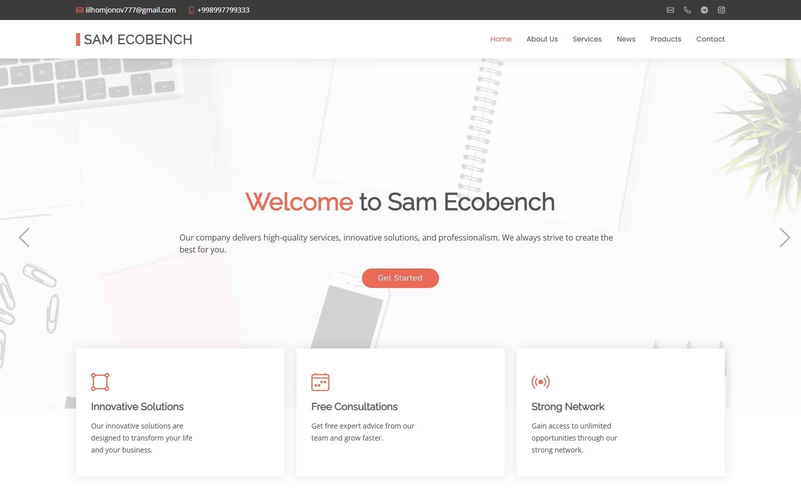
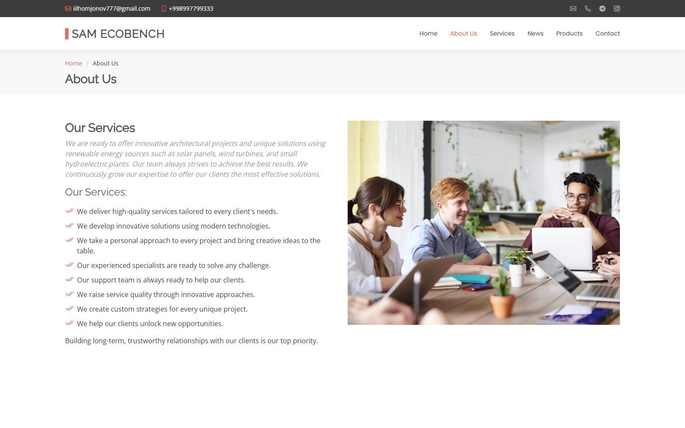
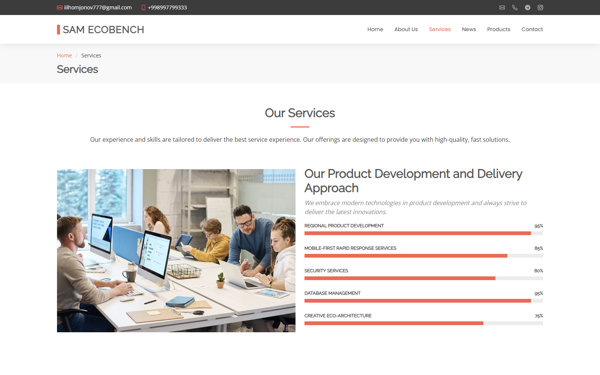
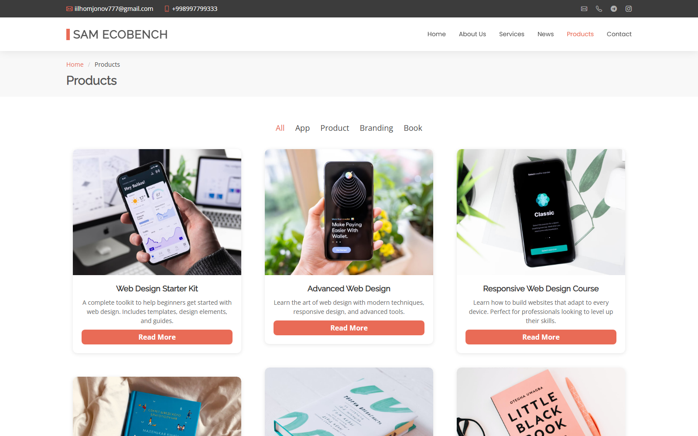
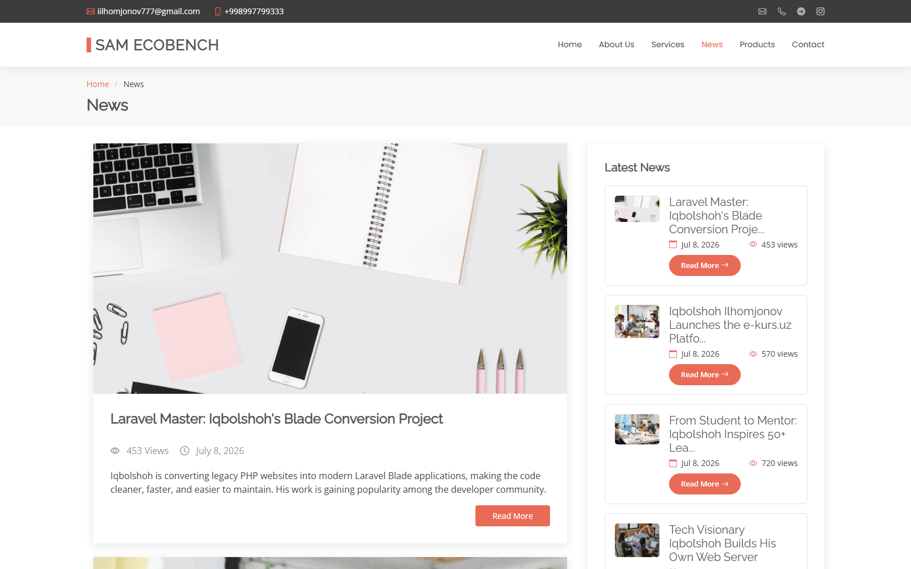
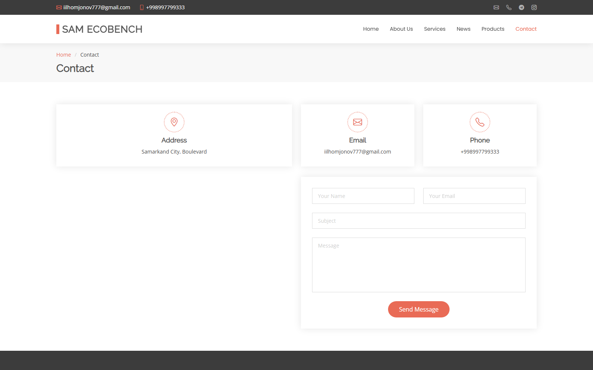
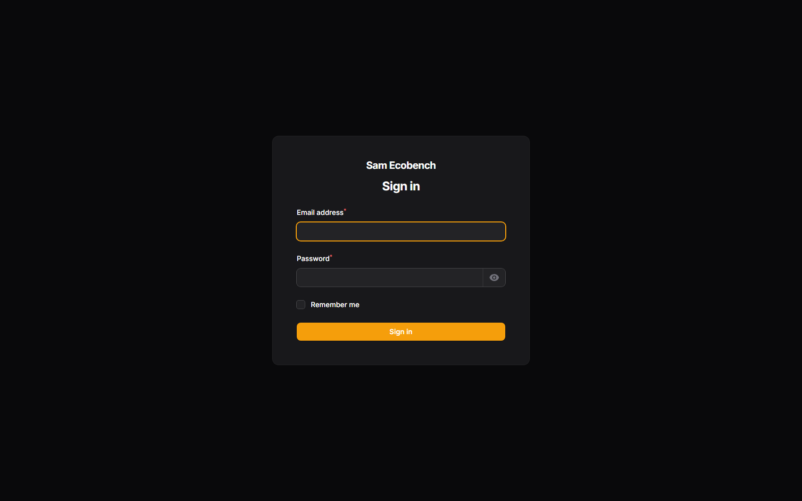

# 🏢 Sam Ecobench

**Sam Ecobench** is a **full-featured business website** built with **Laravel** and the **Filament** admin panel. It pairs a modern, responsive public site — home, about, services, products, and news pages — with a powerful admin dashboard for managing every piece of content: banners, products, services, news, statistics, social links, and incoming contact messages, all with role-based access control.

<p align="left">
  
  
  
  
  
</p>

## 📚 Table of Contents

- [Features](#-features)
- [Preview](#-preview)
- [Demo Admin Account](#-demo-admin-account)
- [Project Structure](#-project-structure)
- [Requirements](#-requirements)
- [Installation Guide](#️-installation-guide)
- [Technologies Used](#-technologies-used)
- [License](#-license)
- [Contributing](#-contributing)
- [Connect with Me](#-connect-with-me)

## ✨ Features

### 1️⃣ Public Website 🌍
✅ **Home page:** Rotating hero banners, feature highlights, and services overview.
✅ **About page:** Company story, key strengths, and live statistics counters.
✅ **Services page:** Detailed service listings alongside skill/expertise progress bars.
✅ **Products page:** Filterable product catalog by category, with a dedicated detail page per product.
✅ **News page:** Paginated articles with a "Latest News" sidebar and view counters.
✅ **Contact page:** Contact form, embedded Google Map, and company contact details.

### 2️⃣ Admin Panel (Filament) 🛠️
✅ **Content management:** Full CRUD for banners, about content, features, statistics, services, and social links.
✅ **Product & category management:** Manage products, categories, and multiple images per product.
✅ **News management:** Create and edit news articles with a rich text editor.
✅ **Message inbox:** View and manage messages submitted through the contact form.
✅ **Role-based access control:** `superadmin` and `manager` roles with granular permissions, powered by Spatie Permission.
✅ **Session management:** View and revoke active user sessions.

## 👀 Preview

### 🏠 Home


### ℹ️ About


### 🛠 Services


### 🛒 Products


### 📰 News


### 📞 Contact


### 🔐 Admin Login


## 🔑 Demo Admin Account

The `RolePermissionSeeder` creates two demo accounts, both sharing the same password: `IQBOLSHOH`.

| 👤 Email | 🔑 Password | 📝 Role |
|:---------|:-------------|:--------|
| `admin@iqbolshoh.uz` | `IQBOLSHOH` | Super Admin (full access) |
| `manager@iqbolshoh.uz` | `IQBOLSHOH` | Manager (view-only access) |

Log in at:
```
http://localhost:8000/admin/login
```

## 📂 Project Structure

```
sam-ecobench.uz/
├── app/
│   ├── Filament/Resources/     # Admin panel CRUD resources (Products, News, Banners, etc.)
│   ├── Http/Controllers/       # Public-facing page controllers
│   └── Models/                  # Eloquent models
├── database/
│   ├── migrations/              # Database schema
│   └── seeders/                 # Demo data (roles, products, news, banners, etc.)
├── resources/
│   ├── views/
│   │   ├── layouts/             # Main Blade layout
│   │   ├── components/          # Header, footer, and shared components
│   │   └── pages/               # Home, about, services, products, news, contact views
│   ├── css/ and js/             # Tailwind & Vite entry files
├── routes/web.php                # Public routes
└── README.md
```

## 📋 Requirements

- PHP **8.2+**
- Composer
- MySQL / MariaDB (SQLite also works for local development)
- Node.js & npm

## ⚙️ Installation Guide 🛠️

### 1️⃣ Clone the Repository 📥
```bash
git clone https://github.com/Iqbolshoh/sam-ecobench.uz.git
```

### 2️⃣ Navigate to the Project Directory 📂
```bash
cd sam-ecobench.uz
```

### 3️⃣ Install Dependencies 📦
```bash
composer install
npm install
```

### 4️⃣ Configure the Environment ⚡
```bash
cp .env.example .env
php artisan key:generate
```
Then set your database credentials in `.env` (MySQL by default):
```env
DB_CONNECTION=mysql
DB_HOST=127.0.0.1
DB_PORT=3306
DB_DATABASE=business_website
DB_USERNAME=root
DB_PASSWORD=
```

### 5️⃣ Run Migrations and Seed Demo Data 🗄️
```bash
php artisan migrate --seed
php artisan storage:link
```

### 6️⃣ Build Front-End Assets 🎨
```bash
npm run build
```

### 7️⃣ Run the Application 🚀
```bash
php artisan serve
```
Then open **`http://localhost:8000`** in your browser, or **`http://localhost:8000/admin/login`** for the admin panel.

## 🖥 Technologies Used


## 📜 License
This project is open-source and available under the [MIT License](./LICENSE).

## 🤝 Contributing
🎯 Contributions are welcome! If you have suggestions or want to enhance the project, feel free to fork the repository and submit a pull request.

## 📬 Connect with Me
💬 I love meeting new people and discussing tech, business, and creative ideas. Let's connect! You can reach me on these platforms:

<div align="center">

[](https://iqbolshoh.uz)
[](mailto:iilhomjonov777@gmail.com)
[](https://github.com/iqbolshoh)
[](https://t.me/templates_uz_support)
[](https://wa.me/998776030033)
[](https://instagram.com/iqbolshoh.dev)
[](https://www.youtube.com/@Iqbolshoh_dev)

</div>
